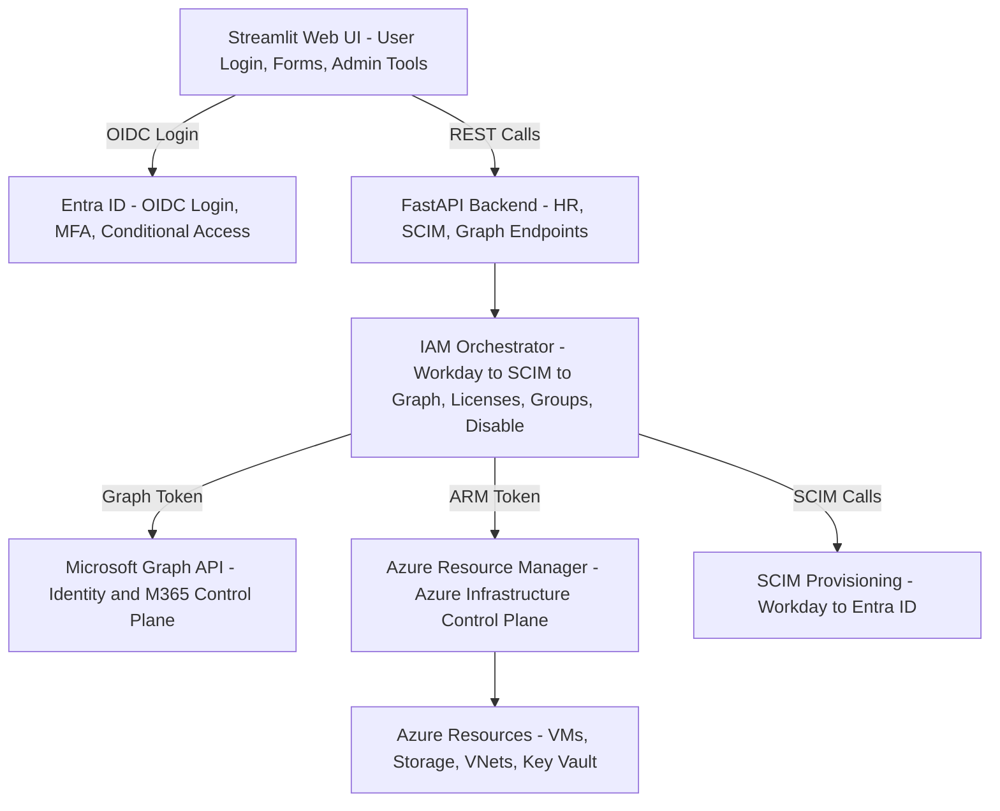

# ⭐ **1️⃣ README.md Architecture Section**

Below is a polished, copy‑paste‑ready section for your GitHub README.  
It explains your IAM Automation Platform in a way that impresses recruiters, hiring managers, and senior engineers.

---

## 📘 **Architecture Overview**

The IAM Automation Platform is a modular, event‑driven system that integrates:

- **Workday (HR events)**
- **SCIM provisioning**
- **Microsoft Graph (identity + M365)**
- **Azure Resource Manager (ARM)**
- **FastAPI backend**
- **Streamlit Web UI**
- **Entra ID authentication**

The platform automates **Joiner–Mover–Leaver (JML)** lifecycle events and provides a secure, web‑based interface for identity operations.

---

## 🧠 **High‑Level Architecture**

```
┌──────────────────────────────────────────────────────────────┐
│                     Streamlit Web UI                         │
│     (New Hire, Update, Termination, CSV Upload, Admin Tools) │
└──────────────────────────────────────────────────────────────┘
                              │
                              ▼
┌──────────────────────────────────────────────────────────────┐
│                       FastAPI Backend                        │
│  /hr/*   /scim/*   /graph/*   (REST API for all operations)  │
└──────────────────────────────────────────────────────────────┘
                              │
                              ▼
┌──────────────────────────────────────────────────────────────┐
│                     IAM Orchestrator                         │
│  - Workday event parsing                                      │
│  - SCIM provisioning                                           │
│  - Graph automation                                            │
│  - License + group assignment                                  │
│  - Termination workflows                                       │
└──────────────────────────────────────────────────────────────┘
                              │
         ┌────────────────────┴────────────────────┐
         ▼                                           ▼
┌──────────────────────────┐            ┌──────────────────────────┐
│     Microsoft Graph      │            │ Azure Resource Manager   │
│ Identity + M365 Control  │            │ Azure Infrastructure API │
│ Users, Groups, Roles     │            │ VMs, Storage, VNets      │
└──────────────────────────┘            └──────────────────────────┘
         │                                           │
         ▼                                           ▼
┌──────────────────────────┐            ┌──────────────────────────┐
│         SCIM API         │            │      Azure Resources     │
│ Workday → Entra ID Sync  │            │ (Optional automation)    │
└──────────────────────────┘            └──────────────────────────┘
```

---

## 🔐 **Authentication & Authorization**

The platform uses **Entra ID** for:

- User login (OIDC)
- MFA
- Conditional Access
- Token issuance (Graph + ARM)
- Role‑based access control (RBAC)

Two token types are used:

| Token Type | Used For | API |
|------------|----------|------|
| **Graph Token** | Identity + M365 | `graph.microsoft.com` |
| **ARM Token** | Azure resources | `management.azure.com` |

---

## 🔄 **Lifecycle Automation (JML)**

The orchestrator handles:

- **Joiner** → SCIM create → Graph sync → license + group assignment  
- **Mover** → attribute updates → group/role re‑evaluation  
- **Leaver** → disable → license removal → group cleanup  

---

## 🧩 **Technology Stack**

| Layer | Technology |
|-------|------------|
| UI | Streamlit |
| Backend | FastAPI |
| Identity | Entra ID (OIDC) |
| Provisioning | SCIM 2.0 |
| Directory | Microsoft Graph |
| Infra | Azure ARM |
| Auth Library | MSAL |
| Language | Python |

---

## 🚀 **Key Features**

- Automated provisioning (Workday → SCIM → Entra ID)
- Graph‑based identity automation
- Azure ARM integration (optional)
- Secure login with Entra ID
- CSV bulk provisioning
- Admin tools for identity operations
- Modular, extensible architecture


────────────────────────────────────────────────────────────────────────────
                     JOINER → MOVER → LEAVER (JML) LIFECYCLE
────────────────────────────────────────────────────────────────────────────

JOINER (New Hire)
────────────────────────────────────────────────────────────────────────────
1. Workday Event: "Hire" or "Pre-Hire"
2. Workday sends SCIM → Entra ID (User Created in Provisioning State)
3. IAM Orchestrator receives event via FastAPI /hr/new-hire
4. Orchestrator performs:
      - SCIM Create (if needed)
      - Graph User Create (if SCIM not authoritative)
      - Attribute population (job title, department, manager)
      - Group assignment (dynamic + static)
      - License assignment (M365, Teams, SharePoint, Intune)
      - Role assignment (if applicable)
5. Notifications / Logging
6. User becomes Active in Entra ID
7. User signs in via Entra ID (MFA + Conditional Access)
────────────────────────────────────────────────────────────────────────────


MOVER (Update)
────────────────────────────────────────────────────────────────────────────
1. Workday Event: "Job Change", "Department Change", "Manager Change"
2. Workday sends SCIM → Entra ID (User Updated)
3. IAM Orchestrator receives event via FastAPI /hr/update
4. Orchestrator performs:
      - Attribute updates (title, department, location)
      - Group re-evaluation (add/remove)
      - License re-evaluation (add/remove)
      - Role re-evaluation (add/remove)
      - Manager-based access updates
5. Notifications / Logging
6. User continues with updated access
────────────────────────────────────────────────────────────────────────────


LEAVER (Termination)
────────────────────────────────────────────────────────────────────────────
1. Workday Event: "Termination" or "End Employment"
2. Workday sends SCIM → Entra ID (User Disabled in Provisioning)
3. IAM Orchestrator receives event via FastAPI /hr/termination
4. Orchestrator performs:
      - Disable account in Entra ID
      - Remove all licenses
      - Remove all group memberships
      - Remove all roles
      - Reset password / block sign-in
      - Move mailbox to inactive state (optional)
      - Archive OneDrive / SharePoint (optional)
      - Notify manager / HR (optional)
5. Notifications / Logging
6. User becomes Disabled / Deleted (based on retention policy)
────────────────────────────────────────────────────────────────────────────


SUPPORTING SYSTEMS
────────────────────────────────────────────────────────────────────────────
- Streamlit Web UI (manual overrides, admin tools)
- FastAPI Backend (API gateway)
- IAM Orchestrator (business logic)
- Microsoft Graph (identity + M365)
- SCIM (Workday → Entra ID provisioning)
- Azure ARM (optional infra automation)
- Entra ID (authentication, MFA, CA)
────────────────────────────────────────────────────────────────────────────
────────────────────────────────────────────────────────────────────────────
                         TOKEN FLOW ARCHITECTURE
────────────────────────────────────────────────────────────────────────────

USER → STREAMLIT UI LOGIN
────────────────────────────────────────────────────────────────────────────
1. User opens Streamlit Web UI
2. Streamlit redirects user to Entra ID (OIDC Authorization Code Flow)
3. User completes:
      - Password
      - MFA (if required)
      - Conditional Access evaluation
4. Entra ID returns:
      - ID Token (identity of user)
      - Authorization Code (short-lived)
5. Streamlit exchanges Authorization Code for:
      - ID Token (for UI session)
      - Access Token (optional, if calling backend directly)
      - Refresh Token (optional, depending on config)
────────────────────────────────────────────────────────────────────────────


STREAMLIT → FASTAPI BACKEND
────────────────────────────────────────────────────────────────────────────
6. Streamlit sends API requests to FastAPI
      - Usually includes a session cookie or bearer token
7. FastAPI validates the token (signature + issuer + audience)
8. FastAPI does NOT use the user’s token to call Graph or ARM
      - Instead, FastAPI uses its own service principal
────────────────────────────────────────────────────────────────────────────


FASTAPI → ENTRA ID (MSAL)
────────────────────────────────────────────────────────────────────────────
9. FastAPI uses MSAL ConfidentialClientApplication to request:

   A. GRAPH ACCESS TOKEN
      Scope: https://graph.microsoft.com/.default
      Used for:
        - Users
        - Groups
        - Roles
        - Licenses
        - M365 workloads

   B. ARM ACCESS TOKEN
      Scope: https://management.azure.com/.default
      Used for:
        - Azure VMs
        - Storage
        - Networking
        - Key Vault
        - Resource Groups

10. Entra ID returns:
      - Access Token (Graph)
      - Access Token (ARM)
      - Refresh Token (for backend service principal)
────────────────────────────────────────────────────────────────────────────


FASTAPI → IAM ORCHESTRATOR
────────────────────────────────────────────────────────────────────────────
11. FastAPI passes tokens to the Orchestrator
12. Orchestrator performs:
      - SCIM provisioning
      - Graph automation
      - ARM automation (optional)
────────────────────────────────────────────────────────────────────────────


IAM ORCHESTRATOR → GRAPH / ARM / SCIM
────────────────────────────────────────────────────────────────────────────
13. GRAPH TOKEN used for:
      - Create user
      - Update user
      - Disable user
      - Assign licenses
      - Assign groups
      - Assign roles

14. ARM TOKEN used for:
      - Create Azure resources (optional)
      - Assign Azure RBAC roles
      - Manage Key Vault secrets
      - Manage Storage accounts

15. SCIM used for:
      - Workday → Entra ID provisioning
────────────────────────────────────────────────────────────────────────────


TOKEN TYPES SUMMARY
────────────────────────────────────────────────────────────────────────────
ID TOKEN
- Used by Streamlit UI
- Identifies the logged-in user
- Not used for API calls to Graph or ARM

ACCESS TOKEN (GRAPH)
- Used by backend to call Microsoft Graph

ACCESS TOKEN (ARM)
- Used by backend to call Azure Resource Manager

REFRESH TOKEN
- Used by backend service principal to silently renew tokens
────────────────────────────────────────────────────────────────────────────
